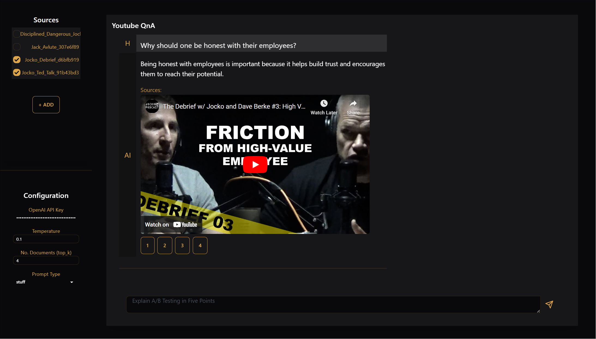

# Youtube QnA

---

Chat with Youtube Channels.



Youtube QnA allows you to add Sources, which are Videos, Channels or Playlists. You can then ask a question, selecting one or more sources to refer from. The videos that are most relevant to the question are embedded in the response, along with a timestamp.

By default, OpenAI's API is used to generate answers, this requires you to have an OpenAI API Key. If you want to use your own LLM, refer to [README#Bring your own LLM](README.md#Bring your own LLM).

### Features:

- Query Entire Youtube Channels, Playlists, or Single Videos.
- Fast and Efficient
- Easy to Modify and Extend

### Usage:

- Available as a Docker Container
  ```bash
  docker run \
      -p 8080:80 \
      -v $(pwd)/youtube_qna_data:/app/src/data \
      theonlywayup/youtube-qna:tagname
  ```
- Available as a Windows Executable (`.exe`), refer to the releases section.

### Contributing:

Contributions are welcome. This application uses SvelteKit and FastAPI.

- [Frontend](src/Frontend): SvelteKit Application, compiled to Static Site on Deployment.
- [Server](src/Backend): FastAPI Application, serves Bundled Frontend Program.

### Bring your own LLM:

If you want to use your own LLM, you can clone the repository and modify [server.py#L374](src/Backend/src/server.py#L374) with an LLM of your [choosing](https://python.langchain.com/en/latest/modules/models/llms/integrations.html). Ensure that you modify the import statements to reflect this change.

---

<div align="center">
    <p>TheOnlyWayUp © 2023</p>
</div>
